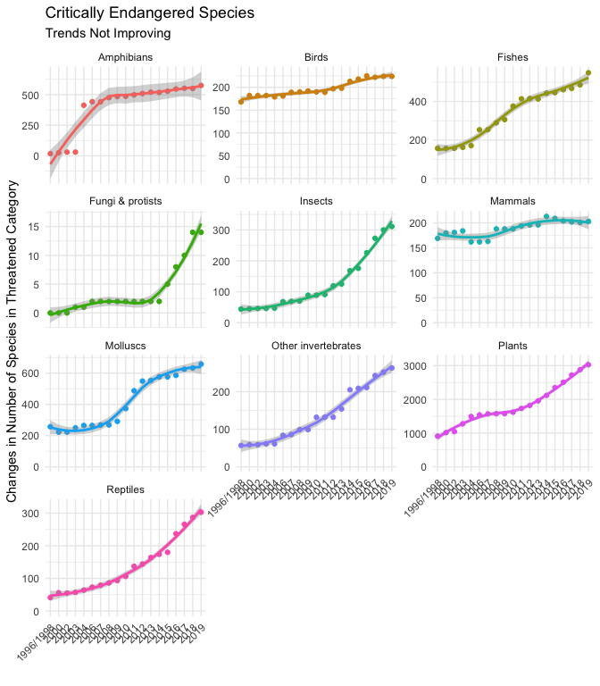

PDF Scraping in R with tabulizer
================
Jennifer Cooper
9/21/2019

<!-- -->

This article comes from [Jennifer
Cooper](https://www.linkedin.com/in/jennifermariecoopermba/), a new
student in [Business Science
University](https://university.business-science.io/?affcode=173166_fpyudtfo).
Jennifer is 35% complete with the 101 course - and shows off her
progress in this PDF Scraping tutorial. Jennifer has an interest in
understanding the *plight of wildlife* across the world, and uses her
new data science skills to perform a useful analysis - ***scraping PDF
tables of a Report on Endangered Species with the `tabulizer` R package
and visualizing alarming trends with `ggplot2`***.

# Scraping PDFs and Analyzing Endangered Species

<small>by Jennifer Cooper, Marketing Data Scientist at Skopos
Financial</small>

I’ve been “heads down” this weekend working on a special R project. This
week I gave myself a challenge to start using R at work and also come up
with a project on the side that I could use to help review what I’ve
learned so far in Business Science University’s DS4B 101-R course (Link
to ⭐️FREE⭐️ Jumpstart course: <https://bit.ly/2KALtJN>).

In addition to being passionate about data science, I also love animals
and am concerned about the plight of wildlife across the world,
particularly with climate change. I decided to take a look at data on
critically endangered species.

The only thing I could find was in a **PDF format**, so I spent a lot of
time trying to figure out the nuances of `tabulizer`. I finally got it
done tonight\!

Through this process, I discovered I still need a lot more practice, so
I’m going to continue seeing what I can do to apply it at work (figured
out how to connect to our SQL database this week), carve out more time
to practice, and I may write up an article on working with `tabulizer`
and PDFs.

Interested in learning \#R? Join me in the 101 course:
<https://bit.ly/2KALtJN>

# My Workflow

Here’s a diagram of the workflow I used:

1.  Start with PDF

2.  Use `tabulizer` to extract tables

3.  Clean up data into “tidy” format using `tidyverse` (mainly `dplyr`)

4.  Visualize trends with `ggplot2`

<!-- -->

# Get the PDF

I analyzed the [Critically Endangered Species PDF
Report](https://github.com/Coopmeister/data_science_r_projects/blob/master/endangered_species.pdf).

# PDF Scrape and Exploratory Analysis

## Step 1 - Load Libraries

Load the following libraries to follow along.

``` r
library(rJava)      # Needed for tabulizer
library(tabulizer)  # Handy tool for PDF Scraping
library(tidyverse)  # Core data manipulation and visualization libraries
```

Note that `tabulizer` depends on `rJava`, which may require some setup.
Here are a few pointers:

  - **Mac Users:** If you have isses connecting Java to R, you can try
    running `sudo R CMD javareconf` in the Terminal ([per this
    post](https://github.com/rstudio/rstudio/issues/2254))

  - **Windows Users:** [This blog
    article](https://cimentadaj.github.io/blog/2018-05-25-installing-rjava-on-windows-10/installing-rjava-on-windows-10/)
    provides a step-by-step process for installing `rJava` on Windows
    machines.

## Step 2 - Extracting the Tabular Data from PDF

The `tabulizer` package provides a suite of tools for extracting data
from PDFs. The vignette, [“Introduction to
tabulizer”](https://cran.r-project.org/web/packages/tabulizer/vignettes/tabulizer.html)
has a great overview of `tabulizer`’s features.

We’ll use the `extract_tables()` function to pull out the tables from
the Endangered Species
Report.

``` r
endangered_species_scrape <- extract_tables("endangered_species.pdf", method = "decide", output = "data.frame")
```

The table I’m interested in is the first one - the Critically Endangered
Species. I’ll extract it using the `pluck()` function and convert it to
a `tibble()` (the tidy data frame format). I see that I’m going to need
to do a bit of
cleanup.

``` r
endangered_species_raw_tbl <- endangered_species_scrape %>% pluck(1) %>% as_tibble()

endangered_species_raw_tbl %>% head()
```

    ## # A tibble: 6 x 10
    ##   X     X.1    X.2   X.3    Critically.Endan… X.4   X.5   X.6   X.7   X.8  
    ##   <chr> <chr>  <chr> <chr>  <chr>             <chr> <chr> <lgl> <chr> <chr>
    ## 1 Year  Mamma… Birds Repti… Amphibians Fishe… Moll… Othe… NA    Plan… Fung…
    ## 2 2019  203    224   303    575 549 311       658   263   NA    3,027 14   
    ## 3 2018  201    224   287    550 486 300       633   252   NA    2,879 14   
    ## 4 2017  202    222   266    552 468 273       625   243   NA    2,722 10   
    ## 5 2016  204    225   237    546 461 226       586   211   NA    2,506 8    
    ## 6 2015  209    218   180    528 446 176       576   209   NA    2,347 5

## Step 3 - Clean Up Column Names

Next, I want to start by cleaning up the names in my data - which are
actually in the first row. I’ll use a trick using `slice()` to grab the
first row, and the new `pivot_longer()` function to transpose and
extract the column names that are in row 1. I can then `set_names()` and
remove row 1.

``` r
col_names <- endangered_species_raw_tbl %>%
    slice(1) %>%
    pivot_longer(cols = everything()) %>%
    mutate(value = ifelse(is.na(value), "Missing", value)) %>%
    pull(value)

endangered_species_renamed_tbl <- endangered_species_raw_tbl %>%
    set_names(col_names) %>%
    slice(-1)

endangered_species_renamed_tbl %>% head()
```

    ## # A tibble: 6 x 10
    ##   Year  Mammals Birds Reptiles `Amphibians Fis… Molluscs `Other inverteb…
    ##   <chr> <chr>   <chr> <chr>    <chr>            <chr>    <chr>           
    ## 1 2019  203     224   303      575 549 311      658      263             
    ## 2 2018  201     224   287      550 486 300      633      252             
    ## 3 2017  202     222   266      552 468 273      625      243             
    ## 4 2016  204     225   237      546 461 226      586      211             
    ## 5 2015  209     218   180      528 446 176      576      209             
    ## 6 2014  213     213   174      518 443 168      576      205             
    ## # … with 3 more variables: Missing <lgl>, Plants <chr>, `Fungi &
    ## #   protists` <chr>

## Step 4 - Tidy the Data

There are a few issues with the data:

1.  Column 6 is all NA’s - We can just drop this column
2.  3 of the columns are combined - Amphibians, Fishes, and Insects - We
    can `separate()` these into 3 columns
3.  The data is in “wide” format, which isn’t tidy - We can use
    `pivot_longer()` to convert to “long” format with one observation
    for each row
4.  The numeric data is stored as character and several of the numbers
    have commas - We’ll remove commas and convert to numeric
5.  The year and species columns are character - We can convert to
    factor for easier adjusting of the order in the ggplot2
    visualizations
6.  The visualizations will have a percent (proportion) included so we
    can see which species have the most endangered - We can add
    proportions by each year

<!-- end list -->

``` r
endangered_species_final_tbl <- endangered_species_renamed_tbl %>%
    
    # 1. Remove columns with NAs
    select_if(~ !all(is.na(.))) %>%
    
    # 2. Fix columns that were combined
    separate(col  = `Amphibians Fishes Insects`, 
             into = c("Amphibians", "Fishes", "Insects"), 
             sep  = " ") %>%
    
    # 3. Convert to (Tidy) Long Format for visualization
    pivot_longer(cols = -Year, names_to = "species", values_to = "number") %>%
    
    # 4. Fix numeric data stored as character
    mutate(number = str_remove_all(number, ",")) %>%
    mutate(number = as.numeric(number)) %>%
    
    # 5. Convert Character Year & species to Factor
    mutate(Year = as_factor(Year)) %>%
    mutate(species = as.factor(species)) %>%
    
    # 6. Percents by year
    group_by(Year) %>%
    mutate(percent = number / sum(number)) %>%
    mutate(label = scales::percent(percent)) %>%
    ungroup()

endangered_species_final_tbl
```

    ## # A tibble: 190 x 5
    ##    Year  species             number percent label
    ##    <fct> <fct>                <dbl>   <dbl> <chr>
    ##  1 2019  Mammals                203 0.0331  3.3% 
    ##  2 2019  Birds                  224 0.0366  3.7% 
    ##  3 2019  Reptiles               303 0.0495  4.9% 
    ##  4 2019  Amphibians             575 0.0938  9.4% 
    ##  5 2019  Fishes                 549 0.0896  9.0% 
    ##  6 2019  Insects                311 0.0508  5.1% 
    ##  7 2019  Molluscs               658 0.107   10.7%
    ##  8 2019  Other invertebrates    263 0.0429  4.3% 
    ##  9 2019  Plants                3027 0.494   49.4%
    ## 10 2019  Fungi & protists        14 0.00228 0.2% 
    ## # … with 180 more rows

## Step 5 - Visualize the Species

### Summary Visualization

I made a summary visualization using stacked bar chart to show the
alarming trends of critically endangered species over time.

``` r
endangered_species_final_tbl %>%
    mutate(Year = fct_rev(Year)) %>%
    
    ggplot(aes(x = Year, y = number, fill = species)) +
    
    # Geoms
    geom_bar(position = position_stack(), stat = "identity", width = .7) +
    geom_text(aes(label = label), position = position_stack(vjust= 0.5), size = 2) +
    coord_flip() +
    
    # Theme
    labs(
        title = "Critically Endangered Species",
        y = "Number of Species Added to Critically Endangered List", x = "Year"
    ) +
    #scale_fill_brewer() +
    #scale_y_continuous(labels = scales::percent_format()) +
    theme_minimal()
```

<!-- -->

### Trends Over Time by Species

I then faceted the species and visualized the trend over time using a
smoother (`geom_smooth`). Again, we see that each of the species exhibit
increasing trends.

``` r
endangered_species_final_tbl %>%
    mutate(Year = fct_rev(Year)) %>%
    
    ggplot(aes(Year, number, color = species, group = species)) +
    geom_point() +
    geom_smooth(method = "loess") + 
    facet_wrap(~ species, scales = "free_y", ncol = 3) +
    
    # Theme
    expand_limits(y = 0) +
    theme_minimal() +
    theme(legend.position = "none",
          axis.text.x = element_text(angle = 45, hjust = 1)) +
    labs(
        title = "Critically Endangered Species",
        subtitle = "Trends Not Improving",
        x = "", y = "Changes in Number of Species in Threatened Category"
    )
```

<!-- -->

## Parting Thoughts

TODO
